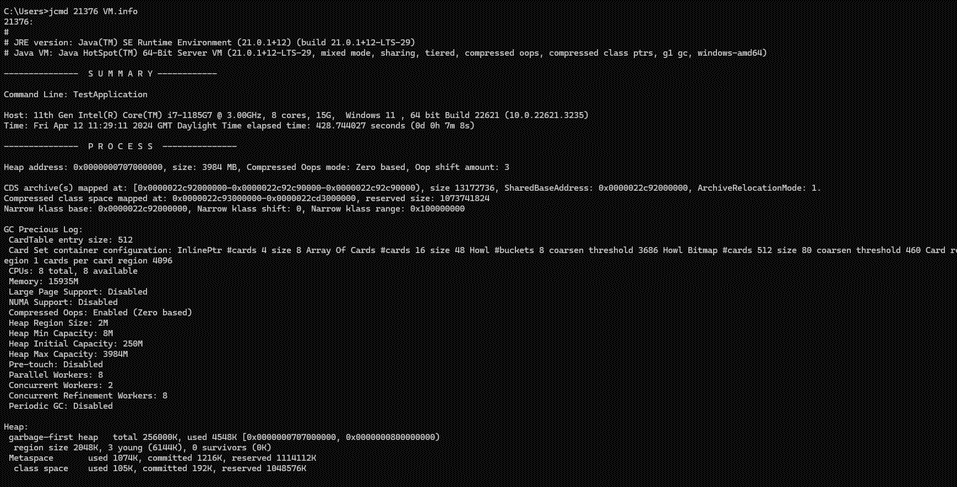

# jcmd Tutorial
Duration: 6 minutes

## jcmd Tutorial

[jcmd Tutorial](videohub:)

1. Introduction

The `jcmd` tool was introduced in Oracle Java 7. It uses the process ID (also known as PID) to acquire heap and thread dumps, to view VM characteristics such as system properties and command-line flags, and also to get garbage collection (GC)-related statistics. Due to these features, the `jcmd` tool is often called ‘a swiss knife for investigating and resolving issues with your JVM application.’

To use jcmd, you need to first identify the process ID against which you want to use the tool. This can be done by simply running `jcmd` in your command prompt. 

As highlighted in the above image, the process ID is the number you see along with your running application.

2. jcmd Options

To view the list of options available with `jcmd`, use `jcmd <PID> help`.

This tutorial is to go through some of these commonly used commands in detail.

3. Additional Help

If you want to know more about a specific command, such as it’s purpose, impact and options that can be passed, use `jcmd <PID> help <COMMAND>`. 

For example, in this image, you can see all the details you need to know for `Thread.print`, such as the description (it print all threads with stack traces), the impact, the syntax used, and options available under, such as `–l` to print details regarding the concurrent locks, and `–e` to print extended thread information.

4. Virtual Machine Commands

Use `jcmd <PID/MAIN_CLASS> VM.info` to print information about the JVM environment and status. As you can see above, it prints complete JVM details.

Use `jcmd <PIDMAIN_CLASS> VM.flags` to print all the flags and their current values. Even if you have not provided any flags, some of the default values will be printed. For example, you can see in the above image the default values set for the initial and maximum heap sizes.

Use `jcmd <PIDMAIN_CLASS> VM.version` to print the JVM version information.

Use `jcmd <PIDMAIN_CLASS> VM.system_properties` to print all the system properties that are set for a VM. For example, in the above image you can find properties like the Java library path, Java VM and vendor information, the operating system details and so on.

5. Garbage Collection Commands

Analyzing a heap dump is one of the best ways to troubleshoot memory-leak problems and optimize memory usage in Java applications.

We can collect a heap dump using `jcmd <PID/MAIN_CLASS> GC.heap_dump <FILENAME>`. This creates a heap dump file at the same location as the application jar.

6. Threads

## Learn More
- [jcmd JDK 11 Documentation](https://docs.oracle.com/en/java/javase/11/tools/jcmd.html)
- [jcmd JDK 8 Documentation](https://docs.oracle.com/javase/8/docs/technotes/guides/troubleshoot/tooldescr006.html)
- Java SE Subscribers can learn more by viewing [Diagnosing a Running Java Virtual Machine (JVM) Using jcmd Command (Doc ID 3015396.1)](https://support.oracle.com/epmos/faces/DocumentDisplay?_afrLoop=292114230920574&id=3015396.1) on My Oracle Support.

## Acknowledgements
**Video** - Anjana Sajeev, Technical Support Engineer, Java Platform Group
**Workshop** -  Jason Begy, Principal User Assistance Developer, Java Platform Group
**Last Updated By/Date** - Jason Begy,  July 2023

